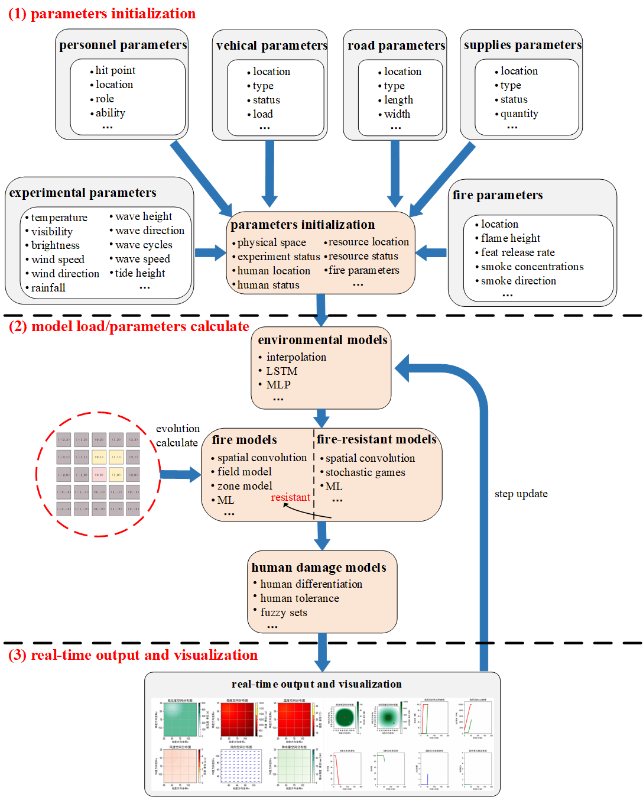
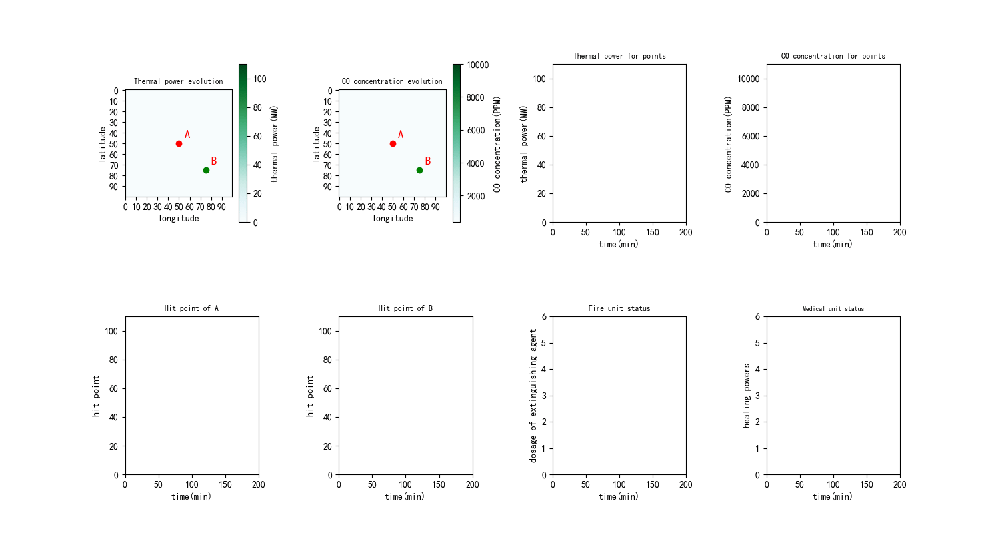

# Fire elolution engine
This is an fire Deduction Engine  

 
**Figure 1** Proposed framework of this study
 
**Figure 1** Evolution of six weather conditions (Visibility, brightness, temperature, wind-speed, wind-direction, and rain-fall)
 
**Figure 2** Evolution of wave conditions (Wave height, wave direction, tide height, wave speed, wave cycles)


 
**Figure 3** Evolution of fire

### Getting started
* Install the required packages:
```angular2html
pip install -r requirements.txt
```
* Run the weather.py to test the environment model.
* Run the examples/example.py to test the fire model, including fire-resistant model and human damage model.
